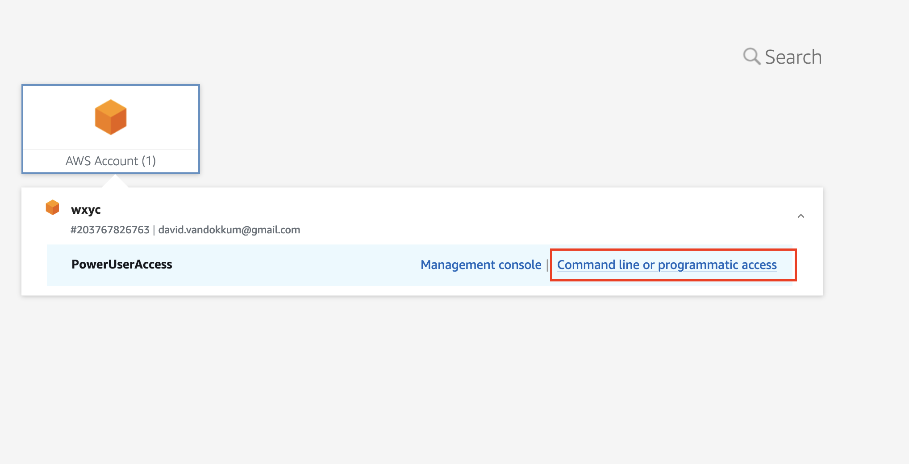
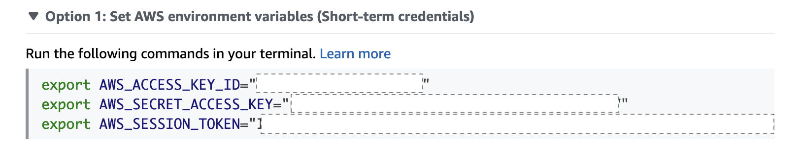
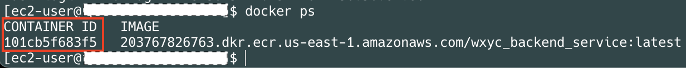

# Backend-Service

#### This is an API that supports wxyc applications with features for dj, flowsheet, and library access/management.

## Usage

## Deploy

The current flow for deploying is a bit involved until we have proper IAM credentials set up for use in scripts <br>

Currently the flow looks like this:

1. Update local aws credentials <br>
   - Locate aws credentials
     
   - Copy updated access key env variables into your terminal
     
2. Login to the AWS ECR repository

```
aws ecr get-login-password --region us-east-1 | docker login --username AWS --password-stdin 203767826763.dkr.ecr.us-east-1.amazonaws.com
```

3. Build docker image for current version using: <br>

```
docker build --platform linux/amd64  -t wxyc_backend_service:latest .
```

4. Tag image to prepare for pushing to AWS ECR <br>

```
docker tag wxyc_backend_service:latest 203767826763.dkr.ecr.us-east-1.amazonaws.com/wxyc_backend_service:latest
```

5. Push image to our ECR repository using <br>

```
docker push 203767826763.dkr.ecr.us-east-1.amazonaws.com/wxyc_backend_service:latest
```

6. SSH into the ec2 instance <br>

```
ssh -i "WXYC_Pair.pem" ec2-user@ec2-54-85-89-12.compute-1.amazonaws.com
```

\*\*This will only work if you have access to the Private Key located in `WXYC_Pair.pem`

7. Repeat steps **1** and **2** on the ec2 instance
8. Pull down the docker image from the ECR repo with:

```
docker pull 203767826763.dkr.ecr.us-east-1.amazonaws.com/wxyc_backend_service:latest
```

9. Find the container ID of the currently running docker container using:

```
docker ps
```

 10. Stop the current container

```
docker stop <continer ID>
```

11. Start new instance

```
docker run -p 8080:8080 --env-file .env 203767826763.dkr.ecr.us-east-1.amazonaws.com/wxyc_backend_service:latest
```

\*\* nginx passes on http and https traffic to port 8080 for the api to operate on hence the `-p 8080:8080` argument.
