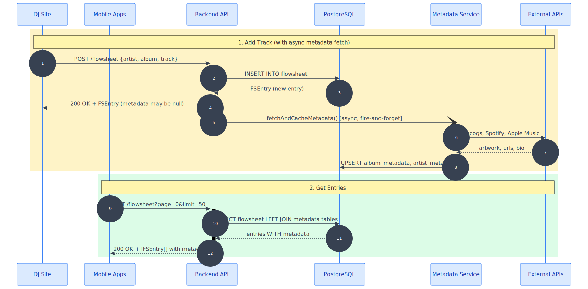

# Metadata Service Backend Integration

This document describes the metadata service integration that moves metadata fetching from the iOS client to the backend service. Clients now receive album art URLs, streaming links, and artist metadata as part of flowsheet responses.

## Table of Contents

- [Overview](#overview)
- [Architecture](#architecture)
- [In-Memory Cache](#in-memory-cache)
- [HTTP Cache Headers](#http-cache-headers)
- [Fire-and-Forget Metadata Fetch](#fire-and-forget-metadata-fetch)
- [Migration Structure](#migration-structure)
- [Network Sequence Diagram](#network-sequence-diagram)
- [Implementation Summary](#implementation-summary)
- [Files Changed](#files-changed)

---

## Overview

### Problem
The iOS client was responsible for fetching metadata (album art, streaming links, artist bios) from multiple external APIs (Discogs, Spotify, Apple Music). This created:
- Redundant API calls across multiple clients
- Inconsistent caching strategies
- Poor offline experience
- API rate limiting issues

### Solution
Move metadata fetching to the backend with:
- **Database-backed storage** for persistent metadata
- **Fire-and-forget fetching** for non-blocking metadata retrieval
- **LEFT JOINs** to include metadata in flowsheet responses automatically
- **In-memory cache** for recent flowsheet entries (reduces database load)

---

## Architecture

The overall system architecture showing how components interact:



> **Note:** Diagram source files are in `diagrams/*.mmd` (Mermaid format). Regenerate SVGs with:
> ```bash
> npx @mermaid-js/mermaid-cli -i diagrams/architecture.mmd -o architecture.svg -b transparent
> ```

### Key Components

| Component | Responsibility |
|-----------|---------------|
| **Flowsheet Controller** | Handles HTTP requests, triggers async metadata fetch |
| **Flowsheet Service** | Database queries with metadata JOINs, in-memory cache |
| **Metadata Service** | Coordinates external API calls, stores results |
| **PostgreSQL** | Persistent storage for flowsheet and metadata tables |
| **External APIs** | Discogs, Spotify, Apple Music for metadata |

---

## In-Memory Cache

The flowsheet service includes an in-memory cache for the most recent entries to reduce database load.

### Configuration

| Setting | Value | Description |
|---------|-------|-------------|
| **Cache Size** | 100 entries | Maximum entries cached |
| **TTL** | 30 seconds | Time before cache expires |

### Behavior

- **Cache hits**: First-page requests (`offset=0`, `limit <= 100`) use cached data when available
- **Cache misses**: Query database, store result in cache
- **Invalidation**: Cache is cleared on any write operation (add, update, delete, reorder)

### Invalidation Triggers

The cache is automatically invalidated when:
- Track is added (`addTrack`)
- Track is deleted (`removeTrack`)
- Track is updated (`updateEntry`)
- Track order changes (`changeOrder`)
- Show starts/ends (flowsheet messages added)
- DJ joins/leaves (flowsheet notifications added)

### Why 30s TTL?

Metadata is fetched fire-and-forget after entries are added. The short TTL ensures clients eventually see metadata without needing complex invalidation logic for async metadata updates.

---

## HTTP Cache Headers

The flowsheet endpoints support standard HTTP caching via `Last-Modified` and `If-Modified-Since` headers. This allows clients to avoid re-downloading unchanged data.

### How It Works

1. **Server response**: Every successful GET response includes a `Last-Modified` header
2. **Client request**: Client stores this timestamp and sends it as `If-Modified-Since` on subsequent requests
3. **304 Not Modified**: If the flowsheet hasn't changed, server returns 304 (no body)
4. **200 OK**: If the flowsheet has changed, server returns full response with updated `Last-Modified`

### Supported Endpoints

| Endpoint | Support |
|----------|---------|
| `GET /flowsheet` | Yes |
| `GET /flowsheet/latest` | Yes |

### Example Flow

```
# First request
GET /flowsheet
→ 200 OK
→ Last-Modified: Sun, 18 Jan 2026 10:30:00 GMT
→ [entries...]

# Subsequent request (no changes)
GET /flowsheet
If-Modified-Since: Sun, 18 Jan 2026 10:30:00 GMT
→ 304 Not Modified
→ (no body)

# After a track is added
GET /flowsheet
If-Modified-Since: Sun, 18 Jan 2026 10:30:00 GMT
→ 200 OK
→ Last-Modified: Sun, 18 Jan 2026 10:35:00 GMT
→ [entries...]
```

### Benefits

- **Reduced bandwidth**: 304 responses have no body
- **Native iOS support**: `URLSession` handles 304 responses automatically
- **Proxy-friendly**: Standard HTTP caching semantics work with CDNs/proxies

---

## Fire-and-Forget Metadata Fetch

When a track is added, metadata is fetched asynchronously without blocking the response:



### Flow

1. **Entry added** - `addTrack()` inserts to database
2. **Check artist_name** - Only fetch metadata for tracks (not talksets/messages)
3. **Fire-and-forget** - Call `fetchAndCacheMetadata()` with `.catch()`
4. **Return immediately** - Client gets response, metadata may be null
5. **Async completion** - Metadata stored in DB, available on next request

### Provider Pipeline

| Provider | Data Retrieved |
|----------|---------------|
| **Discogs** | `artwork_url`, `release_year`, `discogs_url`, `bio`, `wikipedia_url` |
| **Spotify** | `spotify_url` |
| **Apple Music** | `apple_music_url` |
| **Search URLs** | `youtube_music_url`, `bandcamp_url`, `soundcloud_url` |

---

## Migration Structure

The database migration adds two new tables for metadata storage:



### Migration History

| Migration | Purpose |
|-----------|---------|
| `0021_user-table-migration.sql` | DJ refactor (already applied) |
| `0022_library_cross_reference.sql` | Artist/library crossreference tables |
| `0023_metadata_tables.sql` | **NEW** - album_metadata + artist_metadata |

### New Tables

#### `wxyc_schema.album_metadata`

| Column | Type | Purpose |
|--------|------|---------|
| `id` | serial | Primary key |
| `album_id` | integer (FK, unique) | Link to library for known albums |
| `cache_key` | varchar (unique) | Key for non-library entries |
| `artwork_url` | varchar | Album cover image URL |
| `spotify_url` | varchar | Spotify album link |
| `apple_music_url` | varchar | Apple Music album link |
| `discogs_url` | varchar | Discogs release link |
| `youtube_music_url` | varchar | YouTube Music search URL |
| `bandcamp_url` | varchar | Bandcamp search URL |
| `soundcloud_url` | varchar | SoundCloud search URL |
| `release_year` | smallint | Album release year |
| `is_rotation` | boolean | Whether album is in rotation |
| `last_accessed` | timestamp | For tracking usage |

#### `wxyc_schema.artist_metadata`

| Column | Type | Purpose |
|--------|------|---------|
| `id` | serial | Primary key |
| `artist_id` | integer (FK, unique) | Link to artists for known artists |
| `cache_key` | varchar (unique) | Key for non-library artists |
| `discogs_artist_id` | integer | Discogs artist ID |
| `bio` | text | Artist biography |
| `wikipedia_url` | varchar | Wikipedia article link |
| `last_accessed` | timestamp | For tracking usage |

---

## Network Sequence Diagram

This diagram shows the complete request/response flow between all systems:



### Scenarios

#### 1. Add Track
- Client POSTs new track
- Backend inserts to DB
- Fire-and-forget metadata fetch starts
- Client receives response immediately (metadata may be null)
- Metadata service fetches from external APIs asynchronously
- Metadata saved to DB for future requests

#### 2. Get Entries
- Client GETs flowsheet entries
- Query database with LEFT JOINs to include metadata
- Return entries with metadata

---

## Implementation Summary

### Changes Made

| Area | Change |
|------|--------|
| **Migration** | Created 0023_metadata_tables.sql |
| **Flowsheet Service** | Added LEFT JOINs, in-memory cache for recent entries |
| **Flowsheet Controller** | Fire-and-forget metadata fetch on new entries |
| **Database** | New `album_metadata` and `artist_metadata` tables |

### Data Flow Summary



---

## Files Changed

### Core Implementation

| File | Change |
|------|--------|
| `apps/backend/services/flowsheet.service.ts` | Added LEFT JOINs, in-memory cache |
| `apps/backend/controllers/flowsheet.controller.ts` | Fire-and-forget metadata fetch |
| `apps/backend/services/metadata/*` | Metadata service implementation |

### Database

| File | Change |
|------|--------|
| `shared/database/src/schema.ts` | Added `album_metadata` and `artist_metadata` tables |
| `shared/database/src/migrations/0023_metadata_tables.sql` | Migration for metadata tables |
| `shared/database/src/migrations/meta/_journal.json` | Added 0023 entry |

---

## Running the Migration

To apply the migration locally:

```bash
# Start local database (requires Docker)
npm run db:start

# Apply migrations
npm run drizzle:migrate
```

## Verification

After migration, verify:

1. **Tables exist**: `album_metadata` and `artist_metadata` in `wxyc_schema`
2. **Backend starts**: Healthcheck passes at `/healthcheck`
3. **Add track**: Verify metadata appears in subsequent GET requests
4. **Cache works**: Repeated GET requests return consistent results
