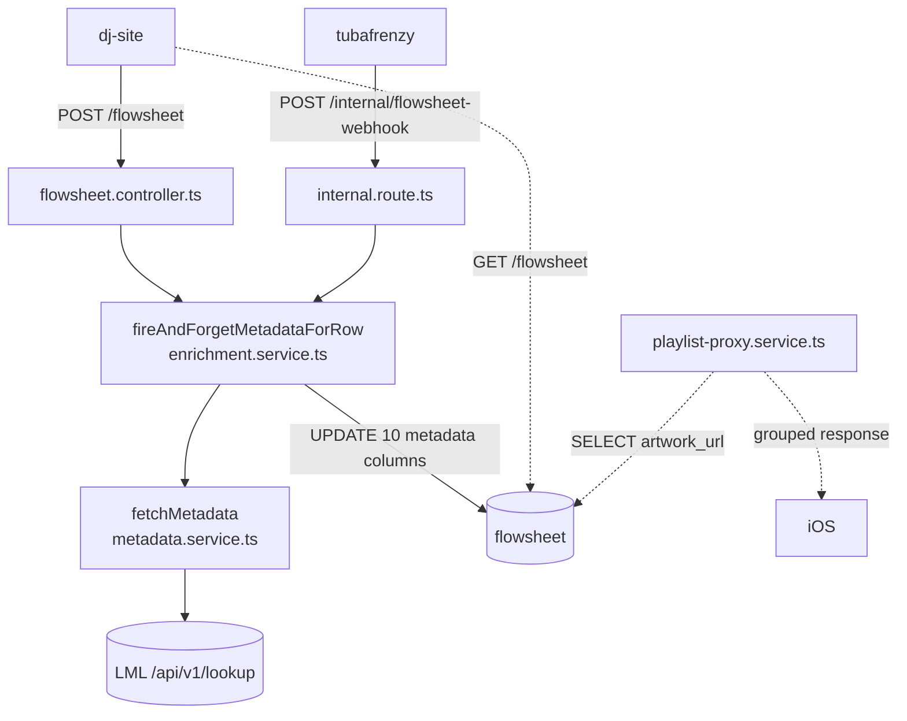

# Metadata Service

This document describes how the backend service fetches and serves album/artist metadata (artwork URLs, streaming links, artist bios) as part of flowsheet responses.

## Overview

When a track is added to the flowsheet, the backend fetches metadata from [library-metadata-lookup](https://github.com/WXYC/library-metadata-lookup) (LML) asynchronously and stores it directly on the flowsheet row. Subsequent GET requests return the metadata inline with the entry. LML handles its own caching of Discogs API data, so no additional cache layer is needed on the backend.


```mermaid
graph TD
    djsite[dj-site] -->|POST /flowsheet| ctrl[flowsheet.controller.ts]
    tuba[tubafrenzy] -->|POST /internal/flowsheet-webhook| webhook[internal.route.ts]
    ctrl & webhook --> helper[fireAndForgetMetadataForRow<br/>enrichment.service.ts]
    helper --> fetchm[fetchMetadata<br/>metadata.service.ts]
    fetchm --> lml[(LML /api/v1/lookup)]
    helper -->|UPDATE 10 metadata columns| pg[(flowsheet)]
    djsite -.->|GET /flowsheet| pg
    proxy[playlist-proxy.service.ts] -.->|SELECT artwork_url| pg
    proxy -.->|grouped response| ios[iOS]
```

## Architecture

| Component                                                                       | Responsibility                                                                                           |
| ------------------------------------------------------------------------------- | -------------------------------------------------------------------------------------------------------- |
| **Flowsheet Controller** (`apps/backend/controllers/flowsheet.controller.ts`)   | Handles `POST /flowsheet` from dj-site; calls the shared enrichment helper after the row is inserted     |
| **Webhook Receiver** (`apps/backend/routes/internal.route.ts`)                  | Handles `POST /internal/flowsheet-webhook` from tubafrenzy; calls the shared enrichment helper on INSERT |
| **Enrichment Service** (`apps/backend/services/metadata/enrichment.service.ts`) | Shared `fireAndForgetMetadataForRow` — fetches metadata and updates the flowsheet row                    |
| **Metadata Service** (`apps/backend/services/metadata/metadata.service.ts`)     | `fetchMetadata` — calls LML's `/lookup` endpoint and shapes the response into the column-mapped result   |
| **LML Client** (`@wxyc/lml-client` — `shared/lml-client/src/index.ts`)          | Single HTTP chokepoint with timeout + bearer auth header                                                 |
| **LML**                                                                         | External service: unified `/lookup` endpoint with 3-tier caching (memory + PostgreSQL + Discogs API)     |

### Metadata Fields on Flowsheet

| Column                 | Type         | Source                                        |
| ---------------------- | ------------ | --------------------------------------------- |
| `artwork_url`          | varchar(512) | LML (Discogs)                                 |
| `discogs_url`          | varchar(512) | LML (Discogs)                                 |
| `release_year`         | smallint     | LML (Discogs)                                 |
| `spotify_url`          | varchar(512) | LML enrichment                                |
| `apple_music_url`      | varchar(512) | LML enrichment                                |
| `youtube_music_url`    | varchar(512) | LML enrichment or search URL fallback         |
| `bandcamp_url`         | varchar(512) | LML enrichment or search URL fallback         |
| `soundcloud_url`       | varchar(512) | LML enrichment or search URL fallback         |
| `artist_bio`           | text         | LML (Discogs artist profile, markup stripped) |
| `artist_wikipedia_url` | varchar(512) | LML (Discogs artist URLs)                     |

## Fire-and-Forget Enrichment

Both flowsheet write paths converge on the same shared helper, `fireAndForgetMetadataForRow` (`apps/backend/services/metadata/enrichment.service.ts`). The promise is intentionally not awaited — enrichment must never block the HTTP response. Errors are logged and reported to Sentry under `subsystem='metadata'`, never thrown.

### dj-site path: `POST /flowsheet`

1. The controller inserts the entry to the database.
2. If the entry has an `artist_name`, `fireAndForgetMetadataForRow` is invoked.
3. The HTTP response returns immediately (metadata columns are null).
4. The helper calls LML's `/api/v1/lookup` endpoint.
5. The row is updated with all 10 metadata columns (see "Always-Update Semantics" below).
6. On the next GET request, the metadata is included in the response.

### Tubafrenzy webhook path: `POST /internal/flowsheet-webhook`

1. The receiver upserts the row from the tubafrenzy event payload.
2. The upsert uses `RETURNING { id, created: (xmax = 0) }`. The `xmax = 0` predicate distinguishes a fresh INSERT from the `ON CONFLICT DO UPDATE` branch. **Load-bearing dependency: this is a Postgres-specific row-version trick — `xmax` is the MVCC slot for the deleting/updating transaction, and only a freshly inserted tuple has `xmax = 0`.** Any future migration to a non-Postgres engine (or to a Postgres major that changes MVCC internals) must replace this with an explicit `INSERT ... ON CONFLICT ... RETURNING (CASE WHEN created_at = updated_at THEN true ELSE false END)` style sentinel, or the enrichment gate (step 3 below) silently fires on every benign update.
3. **Enrichment is gated on `created`.** Benign retries / no-op updates from tubafrenzy do not re-fetch from LML and do not re-write the metadata columns. This avoids amplifying CDC trigger fires + search_doc tsvector regen + 6-index updates on every duplicate webhook delivery.
4. On INSERT, `fireAndForgetMetadataForRow` runs identically to the dj-site path.
5. The `liveFs` SSE refetch event broadcasts immediately after the upsert and does not wait for enrichment to land. **iOS does not subscribe to `liveFs`** — it gets data via `apps/backend/services/playlist-proxy.service.ts`, which subscribes to _tubafrenzy's_ SSE and synchronously SELECTs `flowsheet.artwork_url` per entry. The metadata UPDATE from the floating enrichment promise typically commits ~1–2s after the proxy's SELECT, so iOS shows the new track without art for that window. See [#628](https://github.com/WXYC/Backend-Service/issues/628) for the follow-up that addresses both consumer paths.

### LML Endpoint Used

| Endpoint              | Purpose                                                                                                                                |
| --------------------- | -------------------------------------------------------------------------------------------------------------------------------------- |
| `POST /api/v1/lookup` | Unified lookup: artist correction, title normalization, fallback strategies, artwork, streaming URLs, artist metadata in a single call |

The legacy per-component endpoints (`/api/v1/discogs/search`, `/api/v1/discogs/release/{id}`, `/api/v1/discogs/artist/{id}`) are still available on LML and are used by other Backend-Service paths (catalog search, proxy endpoints), but the metadata enrichment path consolidates onto `/lookup`.

### Always-Update Semantics

`fetchMetadata` always returns a non-null result when LML is configured: when LML returns no artwork, the service fills in `youtube_music_url`, `bandcamp_url`, and `soundcloud_url` with `search?q=<artist> <title>` URLs as a bare-minimum fallback. These are generic search links, not direct album/track URLs — they give iOS / dj-site at least a "search for this on $service" affordance for the long tail of releases LML can't match.

The helper writes all 10 columns on every successful enrichment. A successful enrichment with no artwork still writes search URLs into 3 of those columns and `null` into the other 7. This means **`bandcamp_url IS NULL` is a reliable "this row has never been enriched" signal** — useful for idempotent backfill filters and for distinguishing "we tried and LML found nothing" from "we never tried."

**Load-bearing dependency: the `bandcamp_url IS NULL` signal is only reliable because `fetchMetadata` _always_ synthesizes a `bandcamp_url` search-URL fallback when LML returns no Bandcamp link.** If that fallback is removed (or made conditional on LML returning a real Bandcamp result), the signal collapses to "either never enriched, or enriched and the artist has no Bandcamp" — and every downstream backfill predicate filtering on `bandcamp_url IS NULL` starts re-attempting already-enriched rows. The `metadata_attempt_at` column (migrations.md, Flowsheet attempt-at markers) is the more durable progress marker; new code should prefer it.

## One-shot Recovery: `scripts/backfill-metadata.ts`

For populating metadata on rows inserted before enrichment was wired in (PR #627), or for rows where a prior enrichment failed silently because LML auth was misconfigured (see Configuration), there's a one-shot script:

```bash
dotenvx run -f .env -- npx tsx scripts/backfill-metadata.ts
```

Env knobs:

- `BACKFILL_LIMIT` — number of entries to process (default `1000`)
- `BACKFILL_DRY_RUN` — set `true` to preview without updating

**Same semantics as the runtime path.** The script always UPDATEs every fetched row, including no-artwork rows that get only the search-URL fallbacks. Filter is `WHERE bandcamp_url IS NULL AND entry_type = 'track'`, so re-runs naturally skip rows already touched by any prior enrichment regardless of artwork outcome.

For the historical tail (legacy NULL rows accumulated before #627 deployed), see [#631](https://github.com/WXYC/Backend-Service/issues/631) — that work needs a containerized backfill job rather than the inline script.

## Conditional GET (304 Not Modified)

The flowsheet endpoints support conditional requests via the `Last-Modified` header and either the `If-Modified-Since` header or `since` query parameter. This allows clients to avoid re-downloading unchanged data.

### How It Works

1. **Server response**: Every successful GET response includes a `Last-Modified` header
2. **Client request**: Client stores this timestamp and sends it back via `If-Modified-Since` header or `since` query parameter
3. **304 Not Modified**: If the flowsheet hasn't changed, server returns 304 (no body)
4. **200 OK**: If the flowsheet has changed, server returns full response with updated `Last-Modified`

### Supported Endpoints

| Endpoint                | Support |
| ----------------------- | ------- |
| `GET /flowsheet`        | Yes     |
| `GET /flowsheet/latest` | Yes     |

## Configuration

| Env var                | Purpose                                                                                                                  |
| ---------------------- | ------------------------------------------------------------------------------------------------------------------------ |
| `LIBRARY_METADATA_URL` | LML service base URL (e.g. `http://localhost:8001`). Without this, metadata fetching is silently skipped.                |
| `LML_API_KEY`          | Bearer token sent on every LML request. Required in production once LML's `LML_REQUIRE_AUTH` is `true`. Optional in dev. |

> ⚠️ **Silent-failure mode.** If `LML_API_KEY` is missing or stale in a deployment where LML enforces auth, every `/lookup` call returns 401. `metadata.service.ts:58-60` catches the error as a `console.warn` and `fetchMetadata` returns null; `fireAndForgetMetadataForRow` then short-circuits without an UPDATE. There's no Sentry escalation, no 5xx — just every flowsheet row writing with all metadata columns null and no obvious symptom. If iOS / dj-site show empty art on every new track, this is the first thing to check.

## Troubleshooting

When iOS or dj-site is missing artwork, walk these in order:

1. **Confirm the row exists.**

   ```sql
   SELECT id, artist_name, album_title, artwork_url, bandcamp_url
   FROM wxyc_schema.flowsheet
   WHERE id = <id>;
   ```

   If `bandcamp_url IS NULL`, no enrichment ever ran on this row — go to step 2. If `bandcamp_url IS NOT NULL` but `artwork_url IS NULL`, enrichment ran and LML found no match — that's a coverage issue, not a wiring issue (see step 5).

2. **Confirm enrichment fired.** Look for `[Flowsheet] Metadata fetch failed` in backend logs around the row's `add_time`. If you see it, the enrichment ran and threw — read the cause. If you see _nothing_, the helper was never called: check that the row's source path (dj-site addEntry vs tubafrenzy webhook) wires `fireAndForgetMetadataForRow`. The webhook path additionally requires `entry_type='track'`, non-null `artist_name`, and the `xmax = 0` (true INSERT) gate.

3. **Confirm LML auth.** SSH to the backend host and run:

   ```sh
   curl -sf -X POST "$LIBRARY_METADATA_URL/api/v1/lookup" \
     -H "Authorization: Bearer $LML_API_KEY" \
     -H "Content-Type: application/json" \
     -d '{"artist":"King Crimson","album":"Discipline","raw_message":"King Crimson Discipline"}'
   ```

   If it returns `{"detail":"Missing authorization"}` or 401, the key on this host doesn't match LML's expected key. See the silent-failure callout in Configuration above.

4. **Confirm LML is healthy.**

   ```sh
   curl -sf "$LIBRARY_METADATA_URL/health"
   ```

   Expect `status: healthy` with all three services (`database`, `discogs_api`, `discogs_cache`) reporting `ok`. A `degraded` Discogs status means the upstream Discogs token is broken — separate operational issue.

5. **Confirm LML can match this artist.** Hit the lookup endpoint directly with the row's exact field values (see step 3's curl). If the response has `song_not_found: true` and `cache_stats.api_calls > 0`, LML actively searched and decided not to match — typically a coverage gap (obscure artist, collaboration trio name, etc.) rather than a Backend-Service bug. File against [`library-metadata-lookup`](https://github.com/WXYC/library-metadata-lookup) with the reproducer.

## Migration History

| Migration                            | Purpose                                                                            |
| ------------------------------------ | ---------------------------------------------------------------------------------- |
| `0023_metadata_tables.sql`           | Created separate album_metadata and artist_metadata cache tables (original design) |
| `0035_inline_flowsheet_metadata.sql` | Added metadata columns to flowsheet table, dropped the cache tables                |
