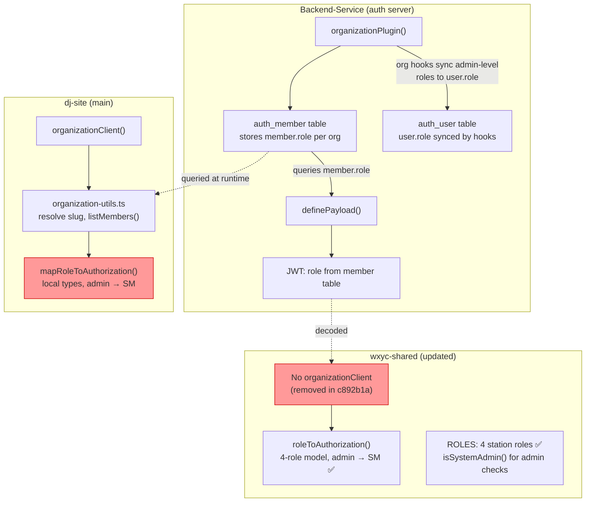
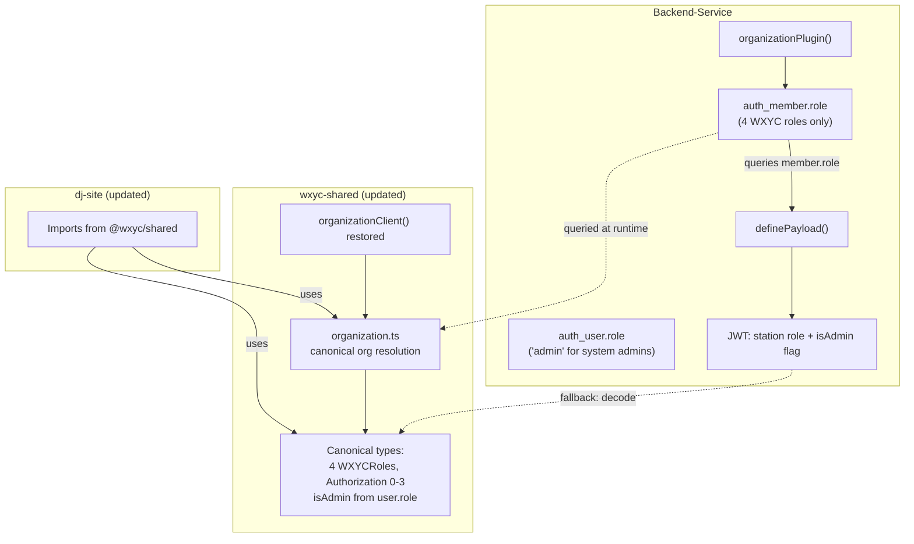

# Proposal 1: Converge on a Shared Auth Model

**Date:** 2026-02-14
**Status:** In Progress

## Background

The three WXYC repos each define their own auth types, role mappings, and organization resolution logic. This has led to divergence: wxyc-shared defines a 5-role hierarchy with `admin` at the top, but `admin` is actually a better-auth system concept, not a WXYC station role. Meanwhile, dj-site defines its own local types that don't match either model, and wxyc-shared removed the `organizationClient` plugin that dj-site depends on. This proposal aligns all three repos on a single auth model owned by wxyc-shared.

### Admin is a system role, not a station role

better-auth's admin plugin provides a built-in `admin` role on `auth_user.role`. It gates user-management operations: creating accounts, banning users, listing users, setting roles. This is orthogonal to what a user can do _at the station_ (play songs, manage the catalog, manage the roster).

The WXYC role hierarchy should only contain station roles:

| Level | Org role | Station permissions |
|-------|----------|---------------------|
| 0 | (none/member) | Read catalog, read/write bin |
| 1 | dj | + Read/write flowsheet |
| 2 | musicDirector | + Write catalog |
| 3 | stationManager | + Manage roster |

Admin (`auth_user.role = 'admin'`) is a separate axis — like capabilities. A station manager who is also a system admin has `auth_member.role = 'stationManager'` and `auth_user.role = 'admin'`.

This resolves the **role mismatch gotcha**: org member roles are always one of the four WXYC roles, so `requirePermissions` never encounters an unrecognized role. better-auth's built-in org roles (`owner`, `admin`, `member`) should never be used as org member roles in WXYC's organization.

## How Role Data Flows Today



The red boxes are the problems: wxyc-shared can't query org roles (no plugin), dj-site's local types diverge, and wxyc-shared conflates the system admin role with the station role hierarchy.

## Type Divergence

| Type | wxyc-shared | dj-site (local) | Status |
|---|---|---|---|
| `WXYCRole` | 4 station roles | 4 roles, no `"admin"` | **Aligned** ([PR #8](https://github.com/WXYC/wxyc-shared/pull/8)) |
| `Authorization` | `NO=0 .. SM=3` | `NO=0 .. SM=3` | **Aligned** ([PR #8](https://github.com/WXYC/wxyc-shared/pull/8)) |
| Role mapping | `admin` → `SM (3)` | `admin` → `SM (3)` | **Aligned** ([PR #8](https://github.com/WXYC/wxyc-shared/pull/8)) |
| `User` type | `AuthorizableUser` with `capabilities` | Local `User`, no `capabilities` | Pending (dj-site needs to adopt shared types) |

## Related PRs

### Backend-Service

| PR | Branch | Status | Action |
|---|---|---|---|
| [#156](https://github.com/WXYC/Backend-Service/pull/156) | `fix/add-admin-role-to-wxyc-roles` | **Closed** | Closed -- adding admin to `WXYCRoles` was the wrong direction |

### dj-site

| PR | Branch | Status | Relevance |
|---|---|---|---|
| [#145](https://github.com/WXYC/dj-site/pull/145) | `fix/auth-organization-utils` | **Closed** | Removed org plugin entirely -- conflicts with org-based direction |
| [#186](https://github.com/WXYC/dj-site/pull/186) | `chore/add-shared-dependency` | Open | Adds `@wxyc/shared` as a dependency (PR 1 of 4) |
| [#183](https://github.com/WXYC/dj-site/pull/183) | `refactor/add-shared-types` | Open | Replaces local DTO types with `@wxyc/shared/dtos` imports (PR 2 of 4) |
| [#136](https://github.com/WXYC/dj-site/pull/136) | `feat/authorized-view-components` | Open | `AuthorizedView` React components using `Authorization` enum |
| [#137](https://github.com/WXYC/dj-site/pull/137) | `feat/admin-role-dropdown-v2` | Open | Role dropdown selector for roster |

## Proposal

### End State



### Two axes of authorization

```
Station role (org membership)     System role (user record)
─────────────────────────────     ────────────────────────
member < dj < MD < SM             user.role = "admin" (or not)
                                  ↓
Checked by requirePermissions()   Checked by better-auth admin plugin
Stored in auth_member.role        Stored in auth_user.role
Embedded in JWT as "role"         Available via session / JWT
```

### Changes by repo

#### 1. wxyc-shared: remove admin from the role hierarchy

Done in [PR #8](https://github.com/WXYC/wxyc-shared/pull/8) (version 0.2.0):

1. ~~**`roles.ts`**: Remove `"admin"` from `ROLES` array and `ROLE_PERMISSIONS`. Update helper functions.~~ Done.
2. ~~**`authorization.ts`**: Remove `Authorization.ADMIN = 4`. Update `roleToAuthorization()`.~~ Done.
3. ~~**`capabilities.ts`**: Update `CAPABILITY_ASSIGNERS` to reference `stationManager` only.~~ Done.
4. **Re-add `organizationClient()`** to the auth client plugins (partially reverts `c892b1a`). **Pending** -- separate follow-up PR.
5. **Add a new `organization.ts` module** ported from dj-site's `organization-utils.ts`. **Pending** -- separate follow-up PR.
6. ~~**Add `isSystemAdmin()`** utility.~~ Done (exported from `@wxyc/shared/auth-client/auth`).
7. ~~**Keep the pure auth entry point**.~~ Already exists.
8. ~~**Publish a new version** of `@wxyc/shared`.~~ Version 0.2.0 (pending merge of PR #8).

#### 2. Backend-Service: close PR #156, update org hooks

1. ~~**Close PR [#156](https://github.com/WXYC/Backend-Service/pull/156)**~~ Done.

2. **Org hooks audit** (`auth.definition.ts`, completed 2026-02-14):
   - The hooks **read** `member.role` to decide whether to sync `user.role`; they do **not write** to `member.role`. The risk of a member ending up with `role = 'admin'` or `'owner'` comes from the better-auth org API being called directly (e.g., manually or from a future admin UI) -- the hooks themselves are safe.
   - The `user.role = 'admin'` sync is correct: it grants station managers access to better-auth admin endpoints (createUser, banUser), which is orthogonal to the station role hierarchy.
   - **Remaining risk**: if someone sets `member.role` to `'admin'` or `'owner'` via the better-auth API, `requirePermissions` will 403. Recommendation: add a role normalization step in the middleware that maps unknown roles to `'member'`-level access with a warning log, as defense in depth.

3. **Update `definePayload()`** to include an `isAdmin` flag derived from `auth_user.role`, so dj-site can show admin UI without an extra session query. **Pending** -- enhancement, not a bug fix.

#### 3. dj-site: replace local types with shared imports

This builds on the existing PR chain (#186 → #183) that is already adding `@wxyc/shared` and replacing local DTO types.

1. **Replace local auth types** with imports from `@wxyc/shared/auth-client`:
   - `WXYCRole` in `authentication/types.ts` → `@wxyc/shared/auth-client`
   - `Authorization` enum in `admin/types.ts` → `@wxyc/shared/auth-client` (same 4 levels, now canonical)
   - `mapRoleToAuthorization()` → `roleToAuthorization()` from `@wxyc/shared/auth-client`

2. **Replace local `organization-utils.ts`** with the canonical version from `@wxyc/shared/auth-client`.

3. **Gate admin UI** using `isSystemAdmin()` from `@wxyc/shared/auth-client` (checks `session.user.role === 'admin'`), not `Authorization.ADMIN`. This affects PRs #136 and #137.

## Sequencing

```mermaid
gantt
    title Converge on Shared Auth Model
    dateFormat X
    axisFormat %s

    section wxyc-shared
    Remove admin from role hierarchy     :done, ws0, 0, 1
    Re-add organizationClient            :ws1, 1, 2
    Add canonical organization.ts        :ws2, after ws1, 2
    Publish new version                  :milestone, ws3, after ws2, 0

    section Backend-Service
    Close PR #156                        :done, bs0, 0, 1
    Audit org hooks                      :done, bs1, 0, 1
    Add isAdmin to JWT payload           :bs2, 1, 2

    section dj-site
    Merge PR #186 (add shared dep)       :dj0, 0, 1
    Replace local auth types with shared :dj2, after ws3 dj0, 3
```



All three repos can work in parallel. dj-site waits for the new wxyc-shared version before replacing its local types.

## Testing Plan

- [x] wxyc-shared: `ROLES` array has 4 entries, no admin ([PR #8](https://github.com/WXYC/wxyc-shared/pull/8))
- [x] wxyc-shared: `Authorization` enum has 4 levels (NO through SM)
- [x] wxyc-shared: `roleToAuthorization("admin")` returns `SM` (safe fallback)
- [ ] wxyc-shared: `organizationClient` works with `listMembers()` and org slug resolution
- [x] wxyc-shared: `isSystemAdmin()` returns true only for `user.role === 'admin'`
- [x] Backend-Service: org hooks never assign 'admin' or 'owner' as org member roles (audit confirmed)
- [ ] Backend-Service: `requirePermissions` accepts all 4 WXYC roles without 403
- [ ] Backend-Service: JWT includes `isAdmin` flag for admin users
- [ ] dj-site: role-based access still works after switching to shared types
- [ ] dj-site: admin UI gated by `isSystemAdmin()`, not `Authorization.ADMIN`
- [x] All three repos agree on the same 4-role hierarchy
