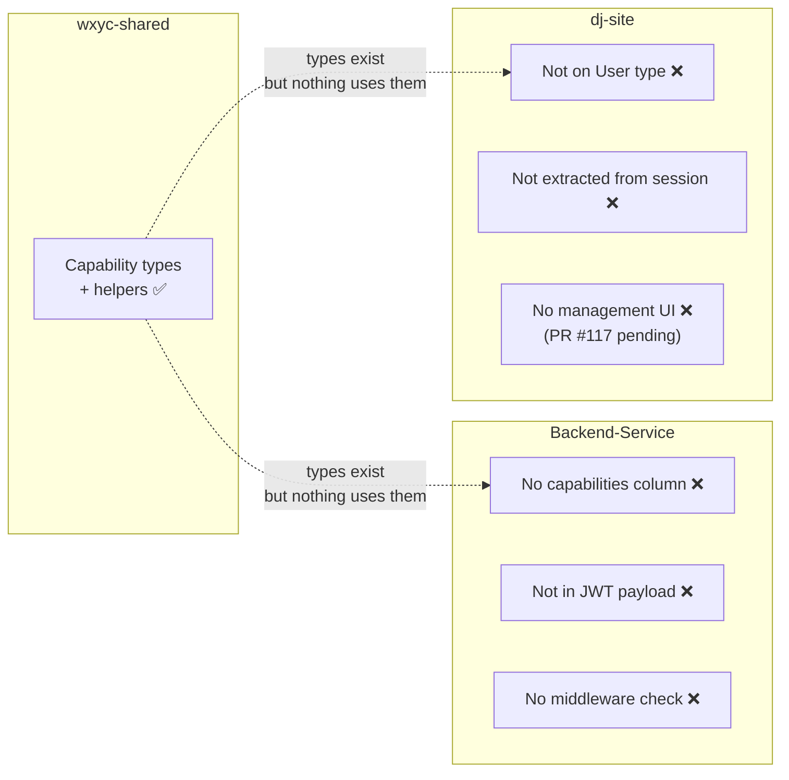
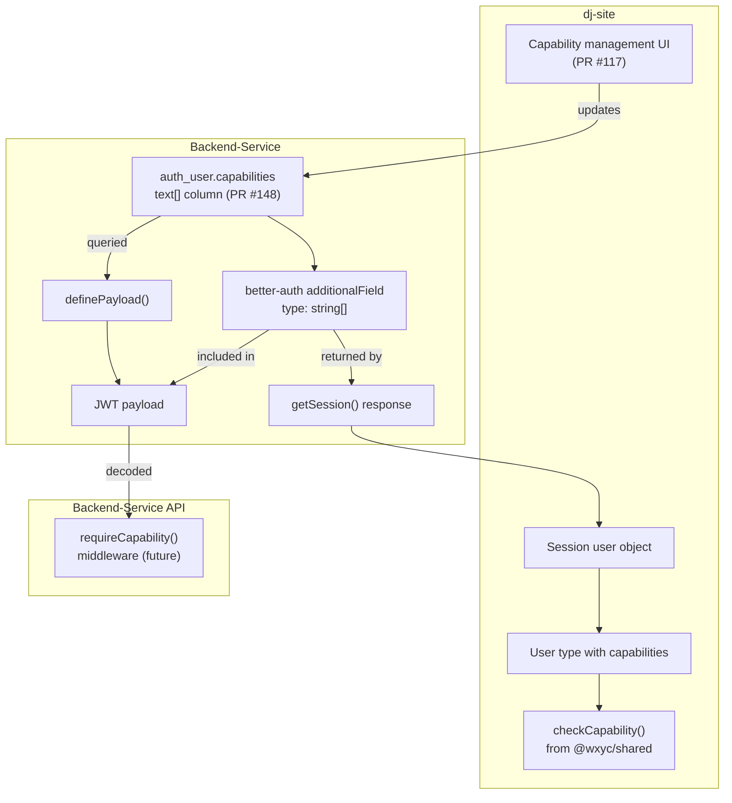

# Proposal 2: Add Cross-Cutting Capabilities

**Date:** 2026-02-14
**Status:** Draft
**Depends on:** [Proposal 1 -- Converge on a Shared Auth Model](./proposal-1-converge-auth-model.md)

## Background

Some permissions don't fit the role hierarchy. A DJ who edits the website shouldn't need to be promoted to Station Manager just to unlock that feature. Capabilities are cross-cutting permissions that can be granted to any user independently of their role.

wxyc-shared already defines the capabilities module. This proposal lands the remaining pieces: database storage in Backend-Service and consumption in dj-site.

## What wxyc-shared Already Provides

**Capabilities** (`src/auth-client/capabilities.ts`):

- `editor` -- can edit website content
- `webmaster` -- can assign the editor capability; has all editor permissions

**Assignment rules** (Proposal 1 removed admin from the role hierarchy in [wxyc-shared PR #8](https://github.com/WXYC/wxyc-shared/pull/8)):

| Capability | Grantable by roles | Grantable by capabilities |
|---|---|---|
| `editor` | stationManager | webmaster |
| `webmaster` | stationManager | (none) |

System admins (`user.role = 'admin'`) can also manage capabilities directly through better-auth's admin API.

**Branded types** (`src/auth-client/authorization.ts`):

- `CapabilityAuthorizedUser<C>` -- user verified to have capability C
- `checkCapability()`, `checkRoleAndCapability()` -- return branded types on success, structured errors on failure

## Problem



1. **No storage.** Backend-Service has no `capabilities` column on `auth_user`.
2. **Not in JWT.** `definePayload` doesn't include capabilities.
3. **Not in payload type.** `WXYCAuthJwtPayload` doesn't declare `capabilities`, so `req.auth.capabilities` is invisible to TypeScript.
4. **Not in session flow.** dj-site's `User` type and `getUserFromSession()` don't extract capabilities.
5. **better-auth version drift.** Backend-Service uses `^1.3.23`; the other repos use `^1.4.9`.

## Related PRs

### Backend-Service

| PR | Branch | Status | Relevance |
|---|---|---|---|
| [#148](https://github.com/WXYC/Backend-Service/pull/148) | `feature/capabilities` | Open | Adds capabilities column, schema field, and JWT payload -- **this is the core PR** |
| [#150](https://github.com/WXYC/Backend-Service/pull/150) | `feature/account-setup-email-capabilities` | Open | Superset of #148 + email changes (stale) -- **close** |

### dj-site

| PR | Branch | Status | Relevance |
|---|---|---|---|
| [#117](https://github.com/WXYC/dj-site/pull/117) | (capabilities UI) | Open | Capability management in roster |

## Proposal

### How capabilities flow end-to-end



Capabilities are stored on `auth_user` (not `auth_member`), so they're available through both the JWT and the session user object. The org API (`listMembers()`) cannot surface them because it returns member records, not user records.

### Changes by repo

#### Backend-Service: revive PR #148

Rebase [#148](https://github.com/WXYC/Backend-Service/pull/148) onto main (after Proposal 1 changes) and apply these additional changes:

1. **Bump better-auth to `^1.4.9`** in both `shared/authentication/package.json` and `apps/auth/package.json` to match dj-site and wxyc-shared.

   ```diff
   - "better-auth": "^1.3.23"
   + "better-auth": "^1.4.9"
   ```

2. **Add `capabilities` to `WXYCAuthJwtPayload`** in `auth.middleware.ts`:

   ```diff
    export type WXYCAuthJwtPayload = JWTPayload & {
      id?: string;
      sub?: string;
      email: string;
      role: WXYCRole;
   +  capabilities?: string[];
    };
   ```

   Without this, capabilities are in the JWT but invisible to `req.auth` consumers.

3. **Import capability types from `@wxyc/shared`** in the test file instead of redefining `CAPABILITIES`, `hasCapability`, and `canEditWebsite` locally.

**Housekeeping:** close PR [#150](https://github.com/WXYC/Backend-Service/pull/150). It overlaps with #148, and its email changes were already shipped in #147.

#### wxyc-shared: add auth context type

Provide a utility that combines role (from org membership) and capabilities (from user record) into a single auth context:

```typescript
type WXYCAuthContext = {
  role: WXYCRole;
  authority: Authorization;
  capabilities: Capability[];
  isAdmin: boolean; // from user.role, not the org role hierarchy
};
```

This type is what Proposal 1's org resolution utilities would return when they combine data from `listMembers()` (role) and the session user object (capabilities, admin status).

#### dj-site: surface capabilities

1. **Add `capabilities` to the `User` type** and `BetterAuthSession`.

2. **Update `getUserFromSession()`** to extract capabilities from the session user object. Since `capabilities` is a better-auth `additionalField`, it appears on the user record returned by `getSession()`.

3. **Land PR [#117](https://github.com/WXYC/dj-site/pull/117)** for capability management UI in the roster, using `canAssignCapability()` from `@wxyc/shared/auth-client` to enforce assignment rules. Note that after Proposal 1, `canAssignCapability` checks for `stationManager` (not `admin`) as the role that can assign capabilities.

## Migration

PR #148 includes migration `0026_capabilities_column.sql`:

```sql
ALTER TABLE "auth_user" ADD COLUMN "capabilities" text[] DEFAULT '{}' NOT NULL;
```

This is additive and non-breaking. Existing users get an empty capabilities array. No data migration is needed.

## Out of Scope (Future Work)

### `requireCapability` middleware in Backend-Service

`requirePermissions` only checks role-based permissions. A companion middleware would enforce capability checks server-side:

```typescript
flowsheet_route.put(
  '/website-content',
  requirePermissions({ flowsheet: ['write'] }),
  requireCapability('editor'),
  controller.updateWebsiteContent
);
```

This would use `req.auth.capabilities` and the types from `@wxyc/shared/auth-client`.

### Add `roster` resource to Backend-Service access control

wxyc-shared defines `roster` as a resource with read/write permissions for stationManager. Backend-Service's access control statements (`auth.roles.ts`) don't include it yet. This should be added alongside roster management API endpoints.

## Sequencing

Assumes Proposal 1 is complete (shared auth model converged).

```mermaid
gantt
    title Add Cross-Cutting Capabilities
    dateFormat X
    axisFormat %s

    section Backend-Service
    Revive PR #148 (capabilities + JWT)     :bs1, 0, 2
    Close PR #150 (stale)                   :milestone, bs2, 0, 0

    section wxyc-shared
    Add WXYCAuthContext type                :ws1, 0, 1
    Publish new version                     :milestone, ws2, after ws1, 0

    section dj-site
    Add capabilities to User + session      :dj1, after bs1 ws2, 3
    Land PR #117 (capability mgmt UI)       :dj2, after dj1, 4
```



## Testing Plan

- [ ] Unit tests for capability storage pass (existing in #148)
- [ ] Build succeeds with bumped better-auth version
- [ ] Integration: create a user with `capabilities: ['editor']`, fetch a JWT, verify the `capabilities` claim is present
- [ ] Integration: `getSession()` returns `capabilities` on the user object
- [ ] Integration: dj-site reads capabilities from session and gates UI accordingly
- [ ] `canAssignCapability()` enforces delegation chain (stationManager can assign anything, webmaster can assign editor only)
- [ ] System admins can manage capabilities via better-auth admin API
